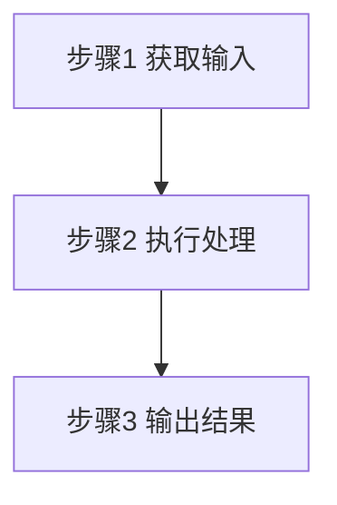

# Figure Generation

Use this reference when drafting section 8 `附图`.

## Default policy

- Default to renderable Mermaid figures, not text-only suggestions.
- Provide at least `图1` and `图2`.
- Keep each figure focused on one technical question only.
- Reuse the canonical terms already defined in `名词解释`.
- Make the figure help section 6, not repeat it mechanically.

## Recommended figure set by invention type

### Software / system

- `图1`：总体系统架构图
- `图2`：核心处理流程图
- Optional `图3`：模块时序图或数据流图

Preferred Mermaid:
- `flowchart LR` for architecture and dependencies
- `flowchart TB` for step-by-step process
- `sequenceDiagram` for inter-module interaction

### AI / algorithm

- `图1`：特征处理或推理架构图
- `图2`：训练、更新、反馈或评分流程图
- Optional `图3`：模型调用时序图

Preferred Mermaid:
- `flowchart LR` for pipeline
- `flowchart TB` for decision logic
- `sequenceDiagram` for collaboration or invocation order
- `stateDiagram-v2` for lifecycle and state transitions

### Device / structure

- `图1`：部件关系示意图
- `图2`：装配流程图、锁定控制图或受力传递图
- Optional `图3`：变体结构对比图

Preferred Mermaid:
- `flowchart TB` for upper-lower or inside-out structure
- `flowchart LR` for force, signal, or assembly sequence

For mechanical inventions, Mermaid is only a functional schematic. Do not fabricate dimensions, tolerances, material numbers, or sectional hatch patterns.

## Output pattern

Use this pattern directly in the `附图` section:

~~~markdown
图1为某某系统的总体架构图。

图2为某某方法的执行流程图。

~~~

## Mermaid safety rules

- Use ASCII node IDs such as `A1`, `M2`, `S3`.
- Use quoted labels such as `A1["协调节点"]`.
- Do not use markdown list text inside labels such as `1. 节点`. Use `步骤1` or `阶段1`.
- Keep labels short, usually no more than 12 Chinese characters.
- Avoid emoji.
- Avoid deep nesting. At most one level of `subgraph`.
- Prefer straight, readable relations over visual decoration.
- Use arrow labels only when the relation needs explanation, such as `上传摘要`, `锁定`, `限位`, `反馈`.

## Patent-specific checks

- Figure names must match the invention type and section 6 content.
- Every core module or component appearing in a figure should already appear in section 6.
- If section 6 emphasizes control logic, section 8 should include that logic in at least one figure.
- If section 6 emphasizes assembly or force transmission, section 8 should include that mechanism in at least one figure.
- If two embodiments differ materially, show the common baseline in `图1` and the differentiated path or structure in `图2` or `图3`.
